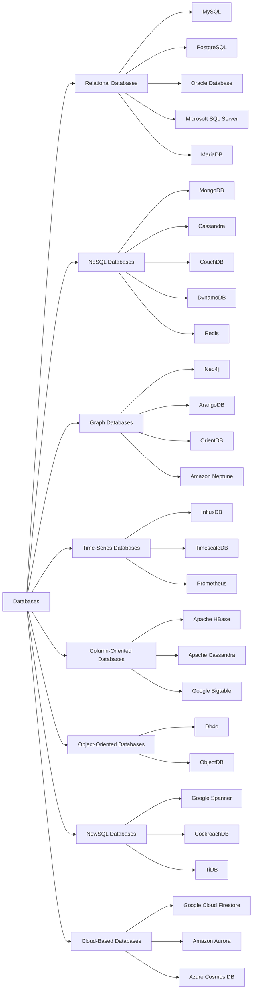

```mermaid
graph LR;
    A[Databases] --> B[Relational Databases]
    A --> C[NoSQL Databases]
    A --> D[Graph Databases]
    A --> E[Time-Series Databases]
    A --> F[Column-Oriented Databases]
    A --> G[Object-Oriented Databases]
    A --> H[NewSQL Databases]
    A --> I[Cloud-Based Databases]

    B --> B1[MySQL]
    B --> B2[PostgreSQL]
    B --> B3[Oracle Database]
    B --> B4[Microsoft SQL Server]
    B --> B5[MariaDB]

    C --> C1[MongoDB]
    C --> C2[Cassandra]
    C --> C3[CouchDB]
    C --> C4[DynamoDB]
    C --> C5[Redis]

    D --> D1[Neo4j]
    D --> D2[ArangoDB]
    D --> D3[OrientDB]
    D --> D4[Amazon Neptune]

    E --> E1[InfluxDB]
    E --> E2[TimescaleDB]
    E --> E3[Prometheus]

    F --> F1[Apache HBase]
    F --> F2[Apache Cassandra]
    F --> F3[Google Bigtable]

    G --> G1[Db4o]
    G --> G2[ObjectDB]

    H --> H1[Google Spanner]
    H --> H2[CockroachDB]
    H --> H3[TiDB]

    I --> I1[Google Cloud Firestore]
    I --> I2[Amazon Aurora]
    I --> I3[Azure Cosmos DB]

```